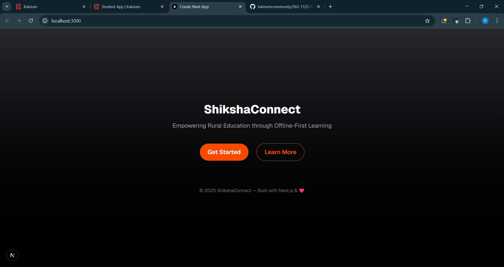
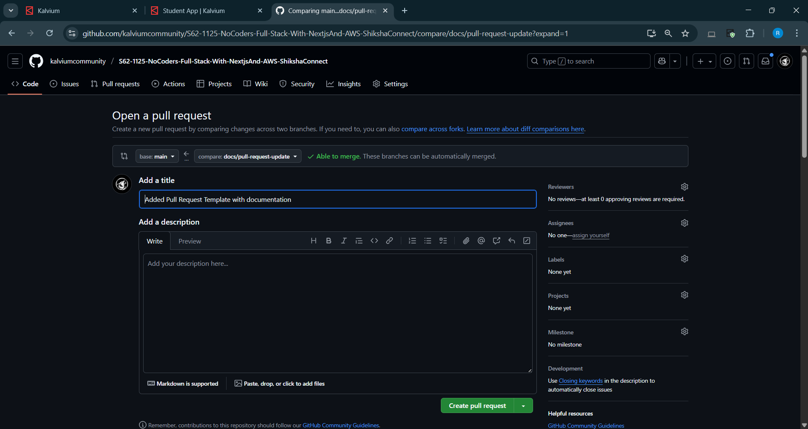

# ShikshaConnect  
> Empowering Rural Education through Offline-First Learning  

---

## Overview

**ShikshaConnect** is a **lightweight, offline-first Progressive Web App (PWA)** designed to make digital education accessible in rural and low-connectivity regions of India.  
It ensures continuous learning through **intelligent caching**, **local storage**, and **background sync**, enabling teachers and students to access educational content anytime, anywhere.

---

## Problem Statement

Rural schools in India face persistent challenges in adopting digital education:

- **Unreliable Internet:** Often below 2 Mbps, breaking typical e-learning tools.  
- **Device Constraints:** Low-end Android devices with limited performance.  
- **Content Gaps:** Lack of localized, culturally relevant study material.  
- **Digital Illiteracy:** Complex tools overwhelm first-time users.

---

## Proposed Solution

ShikshaConnect solves these challenges by building a **resilient, multilingual, offline-capable PWA** that:

- Caches lessons and progress locally using IndexedDB  
- Works seamlessly in low or no-internet conditions  
- Provides simple, teacher-friendly dashboards  
- Supports both English and Hindi interfaces  

---

## Project Scope

### In-Scope (This Sprint)
- Offline-first PWA with caching & background sync  
- Student dashboard for browsing and completing lessons  
- Teacher dashboard for performance tracking  
- JWT-based authentication system  
- Dockerized CI/CD deployment on AWS/Azure  
- IndexedDB for offline data storage  

### Future Enhancements
- AI-based content recommendation  
- Advanced analytics dashboards  
- Mobile native apps  
- Peer-to-peer content sharing  

---

## Team & Role Distribution

| **Focus Area / Role** | **Team Member** | **Key Responsibilities** |
| ---------------------- | --------------- | ------------------------- |
| **Frontend & PWA Focus** | Issac Antony | Build UI with Next.js + Tailwind, manage routing, dashboards, service workers & IndexedDB. |
| **Backend & Database Focus** | John Robert | Create Node.js APIs, manage PostgreSQL + Prisma schema, implement JWT auth, caching, and data sync logic. |
| **DevOps, Testing & Integration Focus** | Karandeep | Handle Docker setup, CI/CD pipelines, AWS/Azure deployment, offline & integration testing, documentation. |

All members collaborate on design, coding, and deployment to ensure shared ownership and learning.

---

## Sprint Timeline (4 Weeks)

| **Week** | **Focus Area** | **Deliverables** |
| -------- | --------------- | ---------------- |
| **1** | Foundation & Setup | Project scaffold, Docker config, DB schema, JWT auth |
| **2** | Core Features | Dashboards, lesson viewer, quiz module |
| **3** | Offline-First Architecture | Service workers, IndexedDB, background sync |
| **4** | Testing & Deployment | Integration tests, optimization, AWS/Azure deploy, documentation |

---

## Folder Structure

```

src/
├── app/          # Next.js App Router — defines routes and pages
├── components/   # Reusable UI components (buttons, cards, modals)
├── lib/          # Utility functions, API configs, constants
├── styles/       # Tailwind and global styles
├── assets/       # Static assets (images, icons, etc.)

````

### Folder Purpose & Naming Conventions

| **Folder** | **Purpose** | **Naming Convention** |
| ----------- | ----------- | ---------------------- |
| `app/` | Contains route definitions and page components. | Use **camelCase** for files (e.g., `lessonView.tsx`). |
| `components/` | Shared reusable UI elements. | Use **PascalCase** (e.g., `Navbar.tsx`, `DashboardCard.tsx`). |
| `lib/` | Utility logic, constants, API handlers. | Use **camelCase** (e.g., `fetchLessons.ts`). |
| `styles/` | Global styles and Tailwind customizations. | Use **kebab-case** (e.g., `globals.css`). |
| `assets/` | Stores icons, logos, images. | Use **kebab-case** (e.g., `logo-light.png`). |

---

## Scalability & Clarity

This modular structure ensures:
- **Separation of concerns:** UI, logic, and routing are isolated.  
- **Scalability:** Easy to add new pages, components, and APIs.  
- **Maintainability:** Team members can independently work in different folders.  
- **Reusability:** Common components avoid code duplication.  
- **Readability:** Consistent naming helps onboard new developers quickly.  

---

## Setup Instructions

### 1️.  Clone the Repository
```bash
git clone https://github.com/kalviumcommunity/S62-1125-NoCoders-Full-Stack-With-NextjsAnd-AWS-ShikshaConnect.git
cd shiksha-connect
````

### 2️.  Install Dependencies

```bash
npm install
```

### 3️.  Run the Development Server

```bash
npm run dev
```

Your app should now be live on [http://localhost:3000](http://localhost:3000).

---

## Screenshot of Local Run

> Below is the screenshot of ShikshaConnect running locally on port 3000.



---

## Reflection

We chose this structure to promote **clarity, scalability, and collaboration**:

* Next.js App Router improves route modularity.
* TypeScript ensures type safety and easier debugging.
* Clear folder segmentation enables parallel team workflows.
* Future sprints can scale effortlessly with feature-based directories.

This foundation supports **clean architecture**, making future iterations (AI modules, analytics, native apps) easier to integrate.

---

## MVP Deliverables

* Secure login (Student / Teacher)
* Course browser & lesson viewer
* Offline mode with sync
* Progress tracking
* Multilingual support (English + Hindi)
* Cloud-deployed PWA

---

## Technology Stack

| **Layer**                | **Technologies Used**                                                |
| ------------------------ | -------------------------------------------------------------------- |
| **Frontend**             | Next.js 14 (App Router), TypeScript, Tailwind CSS, React Context API |
| **Backend**              | Node.js, PostgreSQL, Prisma ORM, JWT Auth                            |
| **PWA Features**         | Service Workers, IndexedDB, Background Sync, Web App Manifest        |
| **Infrastructure**       | Docker, AWS/Azure Cloud, GitHub Actions (CI/CD), Redis (caching)     |
| **Testing & Monitoring** | Jest, Postman, Lighthouse Audits                                     |

---

## Success Metrics

| **Category** | **Indicators**                                 |
| ------------ | ---------------------------------------------- |
| Technical    | Lighthouse ≥ 80, < 300 ms API latency          |
| Development  | Weekly commits, working CI/CD                  |
| UX           | Smooth on 2 GB RAM devices, no offline crashes |

---

## Risks & Mitigation

| **Risk**               | **Impact** | **Mitigation**                   |
| ---------------------- | ---------- | -------------------------------- |
| Team Overload          | High       | Daily stand-ups, MVP-first focus |
| Sync Conflicts         | Medium     | Manual + auto-sync logic         |
| Low Device Performance | Medium     | Lightweight assets & caching     |
| Deployment Failures    | Medium     | Staging tests & rollback CI/CD   |
| Bandwidth Testing Gaps | Low        | Simulated 2G/3G testing          |

---

## Branch Naming Convention

To keep branches consistent and easy to track, follow this pattern:

| Type | Purpose | Example |
|------|----------|----------|
| feature/ | For new features | feature/login-auth |
| fix/ | For bug fixes |    fix/navbar-alignment |
| chore/ | For maintenance tasks | chore/update-dependencies |
| docs/ | For documentation updates | docs/update-readme |

**Rules:**
- Use lowercase letters and hyphens (`-`).
- Keep branch names short and descriptive.
- Always branch off from `main` (or `dev` if your team uses one).

---

## Code Review Checklist

Each Pull Request should be verified against the following:

- [ ] Code follows naming conventions and folder structure  
- [ ] Functionality verified locally  
- [ ] No console errors or warnings  
- [ ] ESLint + Prettier checks pass  
- [ ] Comments and documentation are clear  
- [ ] No sensitive data (API keys, tokens, etc.) exposed  
- [ ] Unit tests (if applicable) are updated or added  

---

## Pull Request Template
A standardized PR template is used for all merges, located at `.github/pull_request_template.md`.

It includes:
- **Summary:** Brief overview of changes
- **Changes Made:** Key modifications or additions
- **Screenshots:** Visual evidence (if UI-related)
- **Checklist:** Pre-merge verification steps

---

## Branch Protection Rules
Main branch protection includes:
- ✅ Require pull request reviews before merging  
- ✅ Require all status checks to pass (lint/test workflows)  
- ✅ Disallow direct pushes to `main`  
- ✅ Require PRs to be up-to-date before merging  



---

## Final Deliverable

A **fully functional PWA** for rural schools that:

* Enables **offline learning**
* Tracks **student progress**
* Supports **multilingual content**
* Runs smoothly on **low-end devices**

---

## 🌍 Environment-Aware Builds & Secrets Management

This update adds **multi-environment configuration** and **secure secret handling** to ensure safe and consistent deployments across development, staging, and production.  
It aligns with *Kalvium Concept-2: Environment-Aware Builds & Secrets Management in Production.*

---

### 🗂️ Environment Files

| File | Purpose |
|------|----------|
| `.env.development` | Local development setup |
| `.env.staging` | Pre-deployment testing setup |
| `.env.production` | Live production setup |
| `.env.example` | Reference file with placeholders (safe to commit) |

> ✅ Only `.env.example` is tracked — all other `.env` files are ignored to protect secrets.

---

### ⚙️ Build Commands

Defined in `package.json` using **env-cmd**:

```bash
npm run dev                # Uses .env.development
npm run build:staging      # Uses .env.staging
npm run build:production   # Uses .env.production
```

---


### 🔐 Secure Secrets

Real credentials (DB URLs, API keys, tokens) are stored in GitHub Secrets:
Settings → Secrets and Variables → Actions

Secrets added:
	•	DATABASE_URL
	•	NEXT_PUBLIC_API_URL

This ensures no sensitive data is ever exposed in the repository or commits.

---

### 🧪 Verification

Commands used for testing and validation:
```bash
npm run build:staging
npm run build:production 
```

Verification Results:
	•	Staging build points to the staging API.
	
    •	Production build points to the live API.
	
    •	.env files are ignored correctly.
	
    •	Secrets load securely from GitHub during build.

---

💭 Reflection
	•	Used separate .env files for each environment.
	
    •	Ensured all sensitive info is excluded via .gitignore.
	
    •	Used GitHub Secrets for secure storage.
	
    •	Verified environment-specific builds using env-cmd.
	
    •	Multi-environment setup improved safety and reliability in CI/CD workflows.

⸻
